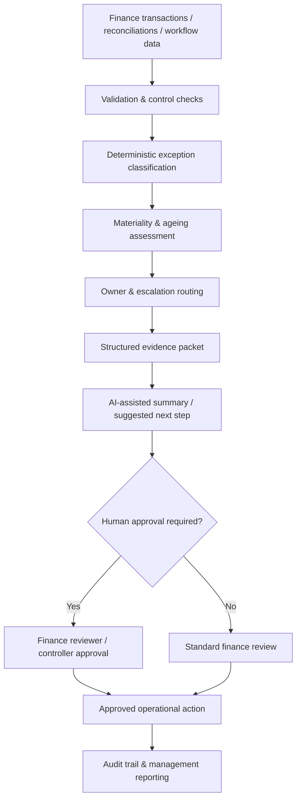

# AI Finance Exception Management

**Finance Transformation | AI-Assisted Operations | Controls | Human Review**

I built this project around a simple question: **where can AI genuinely help Finance teams without weakening the control environment?**

The answer, in my view, is not to let AI make accounting decisions. It is more useful in the investigation layer — summarising exceptions, organising evidence and suggesting the next review step — while deterministic controls and human approval remain authoritative.

This repository models that approach across O2C, P2P, R2R, Intercompany and Treasury using synthetic data.

## The problem

Finance exceptions often sit across different systems, spreadsheets and inboxes. Teams spend time repeatedly working out what happened, how material it is, who owns it and what evidence is still missing.

The same issues also create a risk when AI is introduced too quickly: a model may sound confident even where a finance control should be rule-based and independently verifiable.

## The approach

I separated the workflow into two layers.

**Control layer:** validates the data, calculates variances, classifies the exception, assigns severity and routes ownership using deterministic rules.

**AI-assistance layer:** takes the structured facts and produces a concise review summary and suggested investigation path. It does not post journals, release payments, recognise revenue, change master data or close an exception.

That separation is the core design principle of the project.

## Process flow



## Sample dataset

The synthetic data contains **14 exceptions** across five finance process areas, representing **£720.7k of illustrative expected transaction exposure** and **£143.2k of absolute variance**.

| Severity | Cases |
|---|---:|
| Critical | 2 |
| High | 4 |
| Medium | 6 |
| Low | 2 |

The scenarios include reconciliation breaks, missing documentation, approval failures, possible duplicates and data-quality issues.

## What AI does — and does not do

| Component | Role | Authority |
|---|---|---|
| Validation rules | Check required data and formats | Deterministic |
| Exception rules | Identify the control break | Deterministic |
| Severity model | Prioritise by value, ageing and risk | Deterministic |
| Ownership rules | Route the case | Deterministic |
| AI assistant | Summarise facts and suggest investigation steps | Advisory |
| Finance reviewer | Validate evidence and approve action | Human |

This is deliberate. In a controlled finance process, AI should help the reviewer work faster, not quietly replace policy, approval limits or accounting judgement.

## Example

One synthetic R2R case has an expected clearing balance of **£75,000**, no matched actual balance and has been open for **105 days**.

The rule engine classifies it as a **Critical Reconciliation Break**, assigns it to **Financial Control** and marks it for escalation. The assistant then turns the structured facts into a short review note and suggests the investigation sequence.

The accounting action still sits with the controller.

## Controls built into the design

- required-field and data-type validation;
- deterministic classification before AI is used;
- clear severity and ownership rules;
- structured evidence passed to the assistant;
- no autonomous posting or release actions;
- human approval for material finance decisions;
- traceable reason codes and outputs; and
- synthetic test coverage for core rules.

See [AI Governance](docs/ai_governance.md), [Business Rules](docs/business_rules.md) and [Solution Design](docs/solution_design.md).

## Enterprise view

A production version could connect to ERP, CRM/billing, bank feeds, workflow tools and a governed data layer. The AI component would sit behind enterprise controls such as approved models, prompt/version management, logging, least-privilege access and restricted actions.

See [Enterprise Implementation Blueprint](docs/enterprise_implementation_blueprint.md).

## Repository structure

```text
ai-finance-exception-management/
├── README.md
├── data/
│   └── sample_finance_exceptions.csv
├── src/
│   ├── exception_management_engine.py
│   └── ai_assistant.py
├── outputs/
│   ├── example_exception_actions.csv
│   └── example_management_summary.csv
├── docs/
│   ├── business_rules.md
│   ├── solution_design.md
│   ├── ai_governance.md
│   ├── enterprise_implementation_blueprint.md
│   └── portfolio_story.md
├── tests/
│   └── test_exception_management_engine.py
├── requirements.txt
└── .gitignore
```

## Run locally

```bash
pip install -r requirements.txt
python src/exception_management_engine.py
pytest -q
```

The public version uses an offline assistant stub rather than a live LLM. That keeps the project reproducible, avoids API keys and makes the boundary between finance controls and AI assistance easy to see.

## Why I include this project in my portfolio

For me, the interesting part of AI in Finance is not the chatbot. It is designing the operating model around it: what should stay rule-based, what AI can accelerate, where approval must remain human and how the whole process is audited.

## Portfolio note

This is an independent recreation using fictional entities, synthetic data and generic control scenarios. It contains no employer data, customer information, proprietary logic or confidential financial information.