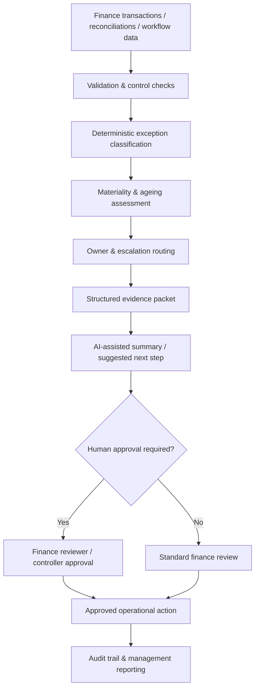

# AI Finance Exception Management

**Finance Transformation | AI-Assisted Operations | Controls | Human-in-the-Loop Automation**

A synthetic portfolio solution showing how finance exceptions can be detected, classified, prioritised, summarised and routed for controlled human review across Order-to-Cash, Procure-to-Pay, Record-to-Report, Intercompany and Treasury.

The project combines deterministic finance controls with an AI-assistant design pattern. Rules establish the factual exception, materiality and ownership; the AI layer is limited to summarisation and decision support. Final finance actions remain subject to human approval.

> **Portfolio integrity:** This project is independently recreated using fictional entities, synthetic data and generic control scenarios. It contains no employer data, customer information, proprietary logic, credentials or confidential financial information.

## Executive summary

### Business problem

Finance teams often spend significant time reviewing exceptions across reconciliations, billing, payments, journals and intercompany processes. Typical problems include:

- fragmented exception queues across systems and spreadsheets;
- inconsistent prioritisation by value, ageing and control risk;
- repeated manual investigation of similar issues;
- weak ownership and escalation paths;
- limited evidence explaining why an exception was flagged; and
- inappropriate use of AI where a deterministic finance control should remain authoritative.

### Solution concept

I designed a hybrid exception-management architecture that separates **control logic** from **AI assistance**.

The solution:

1. validates the incoming finance-exception dataset;
2. calculates amount variance and control indicators;
3. classifies each exception using deterministic rules;
4. assigns severity and accountable finance ownership;
5. builds a structured evidence packet;
6. creates an AI-ready review summary and recommended next action;
7. flags where escalation or finance approval is required; and
8. produces management summaries by process area, exception type and severity.

The AI layer is deliberately non-authoritative: it can explain and summarise the exception, but it cannot post journals, release payments, recognise revenue, change master data or close an exception without human review.

## Hybrid decision model



## Demonstration dataset

The synthetic dataset contains **14 finance exceptions** across five finance process areas, representing **£720.7k of illustrative expected transaction exposure** and **£143.2k of absolute variance**.

| Severity | Cases |
|---|---:|
| Critical | 2 |
| High | 4 |
| Medium | 6 |
| Low | 2 |

The sample includes reconciliation breaks, missing documentation, approval-control failures, potential duplicates and data-quality issues. All figures are synthetic and exist only to demonstrate the operating model.

## AI role versus control role

| Component | Purpose | Authority |
|---|---|---|
| Validation rules | Check required data and formats | Deterministic |
| Exception rules | Identify the control break | Deterministic |
| Severity model | Prioritise by value, ageing and risk | Deterministic |
| Ownership rules | Route to accountable finance team | Deterministic |
| AI assistant | Summarise facts and suggest investigation steps | Advisory only |
| Finance reviewer | Validate evidence and approve action | Human authority |

This separation is intentional. In a finance environment, AI should not silently override accounting policy, approval controls or evidence requirements.

## Example exception

A synthetic R2R case has an expected clearing balance of **£75,000**, no matched actual balance and has remained open for **105 days**. The deterministic engine classifies it as a **Critical Reconciliation Break**, assigns it to **Financial Control**, and marks escalation as required.

The assistant layer receives only the structured facts and produces a concise review packet describing the issue and the recommended investigation path. A controller still decides the accounting action.

## Key capabilities demonstrated

- Multi-process finance exception intake
- Deterministic classification and reason codes
- Amount-variance calculation
- Ageing and materiality prioritisation
- Finance ownership assignment
- AI-ready structured evidence packets
- Explainable assistant summaries
- Human-in-the-loop approval controls
- Escalation logic
- Management summaries by process, severity and exception type
- Synthetic automated tests

## Enterprise implementation view

A production implementation could connect to:

- **ERP:** NetSuite, SAP, Oracle or Dynamics;
- **CRM / Billing:** Salesforce and subscription/billing platforms;
- **Bank / Treasury feeds:** cash and payment data;
- **Workflow:** ServiceNow, case-management or finance work queues;
- **Data platform:** governed transaction and reconciliation datasets;
- **AI platform:** approved enterprise LLM with prompt controls, logging and restricted tool access; and
- **BI:** finance exception dashboards and control MI.

See [Enterprise Implementation Blueprint](docs/enterprise_implementation_blueprint.md) and [AI Governance](docs/ai_governance.md).

## Repository structure

```text
ai-finance-exception-management/
├── README.md
├── data/
│   └── sample_finance_exceptions.csv
├── src/
│   ├── exception_management_engine.py
│   └── ai_assistant.py
├── outputs/
│   ├── example_exception_actions.csv
│   └── example_management_summary.csv
├── docs/
│   ├── business_rules.md
│   ├── solution_design.md
│   ├── ai_governance.md
│   ├── enterprise_implementation_blueprint.md
│   └── portfolio_story.md
├── tests/
│   └── test_exception_management_engine.py
├── requirements.txt
└── .gitignore
```

## Technology

- Python
- pandas
- pytest
- Rules-based control engine
- Provider-agnostic AI-assistant pattern
- Mermaid architecture diagrams
- GitHub documentation and version control

## Run locally

```bash
pip install -r requirements.txt
python src/exception_management_engine.py
pytest -q
```

The public repository intentionally uses an offline deterministic assistant stub rather than calling a live LLM. This keeps the project reproducible, requires no API key and makes the control boundary explicit. The same structured review packet could be passed to an approved enterprise model in production.

## What this project demonstrates professionally

This repository demonstrates how I approach **AI-enabled Finance Transformation**, rather than treating AI as an isolated chatbot use case:

**Finance problem → control design → exception logic → data evidence → AI assistance → human governance → workflow → management insight**

It demonstrates capability across finance operations, process redesign, AI solution architecture, controls, exception management, data quality, UAT thinking, enterprise implementation and business-to-technology translation.

## Disclaimer

This is an independent portfolio project built solely with synthetic data and generic industry scenarios. It should not be represented as the exact operating model, source code, data or AI implementation of any employer. It is not intended to make accounting, payment, revenue-recognition, legal, credit or customer decisions without appropriate professional review.