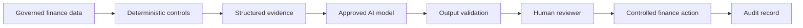

# AI Governance for Finance Exceptions

## Purpose

The AI component in this design is an assistant, not a financial-control authority. It helps reviewers understand and investigate exceptions while deterministic rules and authorised people retain decision rights.

## Permitted AI activities

- Summarise a structured exception packet.
- Explain the known evidence in plain language.
- Suggest investigation steps from an approved action catalogue.
- Prepare case notes for a finance reviewer.
- Group recurring exception themes for management analysis.

## Activities requiring human authority

The assistant must not independently:

- post or reverse journals;
- release or approve payments;
- recognise, defer or adjust revenue;
- issue credit notes or invoices;
- change customer, supplier or bank master data;
- close material reconciliation exceptions;
- alter accounting policy; or
- contact a customer or supplier on a consequential matter without an approved workflow.

## Core controls

### Grounding

Assistant prompts should be populated from governed source fields and explicit control outputs. Free-form model inference must not replace missing evidence.

### Prompt and model versioning

Production implementations should retain the prompt template, model/version, timestamp and relevant configuration used for each assistant response.

### Output validation

Model output should be checked for required fields, unsupported claims and references to facts not present in the evidence packet.

### Human review

Critical and High exceptions, approval failures and duplicate-risk cases should require explicit human approval before an operational action.

### Access control

Use least-privilege access. Reading evidence and drafting a summary should be separated from transactional system permissions.

### Audit trail

Retain source evidence, deterministic rule output, AI output, reviewer decision, timestamp and final action as distinct records.

### Monitoring

Track acceptance rate, reviewer overrides, false positives, unsupported outputs, response time and recurring exception categories. Governance should be tightened if model assistance is not reliable enough for the process.

## Recommended production pattern

The design objective is not maximum autonomy. It is safe reduction of investigation effort while preserving finance accountability.