# Enterprise Implementation Blueprint

## Target operating model

The portfolio prototype demonstrates the decision layer. A production implementation would connect governed finance data, controls, AI assistance, workflow and reporting into one controlled operating model.

## Reference architecture

```mermaid
flowchart LR
    A[ERP / Billing / CRM / Bank] --> B[Data ingestion & validation]
    B --> C[Finance control engine]
    C --> D[Exception store]
    D --> E[Priority & ownership routing]
    E --> F[AI assistant service]
    F --> G[Finance work queue]
    G --> H[Human approval]
    H --> I[Authorised source-system action]
    I --> J[Audit log]
    J --> K[Control & performance dashboard]
```

## Data inputs

Typical inputs could include transaction IDs, legal entity, customer/supplier, expected and actual amounts, reconciliation status, approval state, supporting-document status, ageing, control flags and source-system identifiers.

## Integration pattern

- Use APIs, governed data pipelines or scheduled extracts for source ingestion.
- Keep transaction posting and approval permissions outside the AI service.
- Route cases to existing finance workflow tools where possible rather than creating a parallel operating process.
- Store evidence and case history in a persistent audit layer.
- Feed resolution outcomes back into reporting and model evaluation.

## Delivery phases

### Phase 1 — Discover and baseline

Map current exception types, volumes, effort, owners, controls, false positives, ageing and financial exposure.

### Phase 2 — Standardise controls

Define the canonical exception taxonomy, evidence requirements, deterministic rules, severity thresholds and ownership matrix.

### Phase 3 — Automate triage

Implement validation, classification, routing, queues and management reporting without AI dependency.

### Phase 4 — Introduce AI assistance

Use an approved model for summarisation, evidence synthesis and investigation guidance. Start with read-only assistance and measure reviewer acceptance and override rates.

### Phase 5 — Scale safely

Add process areas, policy-specific rules, integrations and limited workflow actions only where controls, permissions and audit requirements are proven.

## Success measures

- reduction in manual triage minutes per case;
- exception ageing and backlog reduction;
- percentage automatically classified;
- reviewer acceptance versus override rate;
- reduction in repeat exceptions;
- faster time to root cause;
- high-risk cases escalated within SLA;
- audit completeness; and
- released finance capacity.

## Control gates

Before production use, require Finance/Control ownership of rules, approved data access, security review, prompt/model governance, documented UAT, fallback procedures, monitoring and a clearly named accountable process owner.